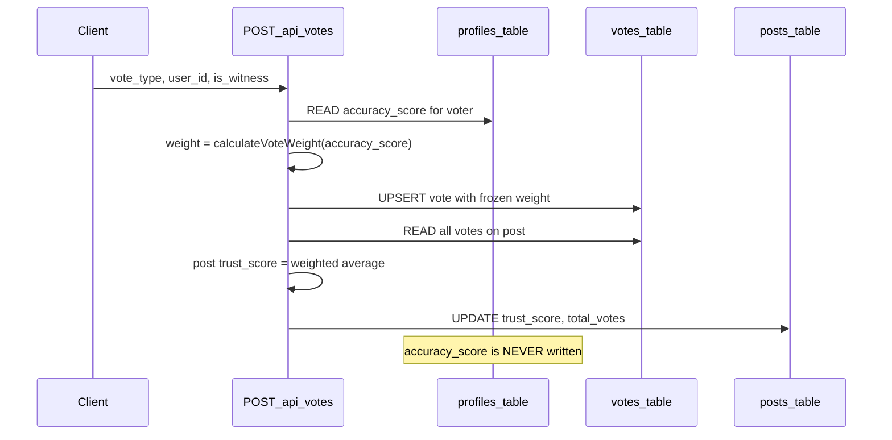

# Accuracy Score: Current Logic vs Ripple Risk

## Short answer

**Today: voting does NOT change anyone’s `accuracy_score`.**  
Only the **post’s** `trust_score` and `total_votes` are recalculated. Other users are unaffected. There is no feedback loop in the running app.

The `+0.5` (etc.) you see in the bottom nav comes from **seed/demo values** in Supabase `profiles`, not from live vote outcomes.

---

## What actually happens on each vote

Flow in [`app/api/votes/route.ts`](app/api/votes/route.ts):

Key details:

1. **Read-only reputation** — `accuracy_score` is fetched once per vote ([lines 79–90](app/api/votes/route.ts)) and used only to compute `weight`.
2. **Frozen weight** — that `weight` is **stored on the vote row** at insert/upsert time ([lines 92–103](app/api/votes/route.ts)). Past votes are never re-weighted.
3. **Post score only** — after upsert, only `posts.trust_score` and `posts.total_votes` are updated ([lines 118–127](app/api/votes/route.ts)).
4. **No profile updates** — [`app/api/profile/route.ts`](app/api/profile/route.ts) only reads or inserts profiles; it never updates `accuracy_score`.

So when User A votes:

| Updates | Does it happen? |
|---------|-----------------|
| Post trust % / ring arc | Yes |
| Vote count on post | Yes |
| Voter A’s `accuracy_score` | **No** |
| Other voters’ `accuracy_score` | **No** |
| Other posts’ scores | **No** |

---

## What the spec planned (not built yet)

[`PROJECT_PLAN.md`](PROJECT_PLAN.md) describes a richer loop:

- **User accuracy** adjusts when a post reaches **consensus** (+0.1 if vote matched verdict, −0.2 if not) — factual posts only.
- **Consensus versioning** — `consensus_version` on posts, `consensus_version_at_vote` on votes, so penalties can be waived when facts change (“shifting ground”).
- **POST /api/votes step 4** — “Recalculate user’s accuracy score (if consensus reached)” ([§8 API spec](PROJECT_PLAN.md)).

Schema columns exist in [`types/database.ts`](types/database.ts) (`consensus_version`, `correct_votes`, `incorrect_votes`, `consensus_version_at_vote`), but:

- `consensus_version` is set to `1` on create and **never incremented**.
- `correct_votes` / `incorrect_votes` are **never updated** in app code.
- No RPC like `recalculate_post_score` or accuracy batch job is wired up.

---

## Would a full spec implementation cause infinite loops?

**Only if designed naively.** A dangerous cycle would look like:

That can oscillate: consensus flips → everyone’s accuracy shifts → weighted post score flips → consensus flips again.

**Safeguards in the spec (and standard practice):**

| Safeguard | Status in MVP | Purpose |
|-----------|---------------|---------|
| **Snapshot weight at vote time** | Implemented | Old votes keep old weight; accuracy changes affect **future** votes only |
| **Consensus version lock** | Columns only | Judge votes against verdict *at time of vote*, not today’s verdict |
| **Accuracy updates on consensus event, not every vote** | Not implemented | Avoid thrashing on each single vote |
| **One-way post recalc from stored weights** | Implemented | Post score = f(stored weights), not f(live accuracy) |

With **frozen weights** (already in place), even if you later add accuracy updates, **post scores would not ripple backward** unless you explicitly add a “recompute all weights from current accuracy” step — which the plan does not require.

A safe future implementation would:

1. On consensus lock (e.g. threshold votes + stable verdict), update **profiles.accuracy_score** for voters on that post only.
2. Compare each vote to verdict **using `consensus_version_at_vote`** (or waive if version changed).
3. **Never** rewrite `votes.weight` for past rows.
4. Optionally refresh the **voter’s** profile in the client after their own vote if their score changed — not all users on every vote.

That breaks the infinite loop: post score and user reputation decouple across time.

---

## Implication for hackathon UI

The bottom-nav label **`@username · +0.5`** ([`components/features/bottom-nav.tsx`](components/features/bottom-nav.tsx)) shows **reputation tier for demo storytelling**, not a live result of voting in this session. For judges:

- **Honest demo copy**: “Reputation weights votes on factual posts; demo users have preset scores.”
- **If you want it to change live**: needs a small consensus + accuracy update feature (out of scope for current MVP unless you explicitly add it).

---

## Optional next steps (only if you want live accuracy)

Minimal safe addition (no ripple on posts):

1. After vote, if `total_votes >= N` and post is FACTUAL, compute discrete verdict (TRUE / PARTIAL / FALSE) from current `trust_score` bands.
2. If verdict is stable vs previous check, adjust **only the current voter’s** `accuracy_score` (+0.1 / −0.2).
3. Return updated `profile.accuracy_score` in vote response; refresh bottom nav from that.
4. Do **not** retroactively update other voters or `votes.weight`.

Full spec (consensus version bumps, batch recalc all voters, vote decay) is larger and belongs post-hackathon.
