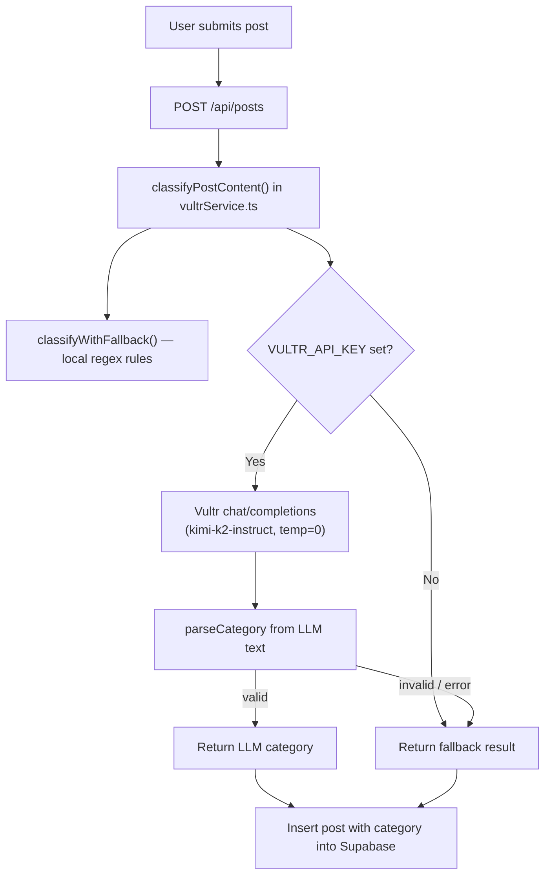
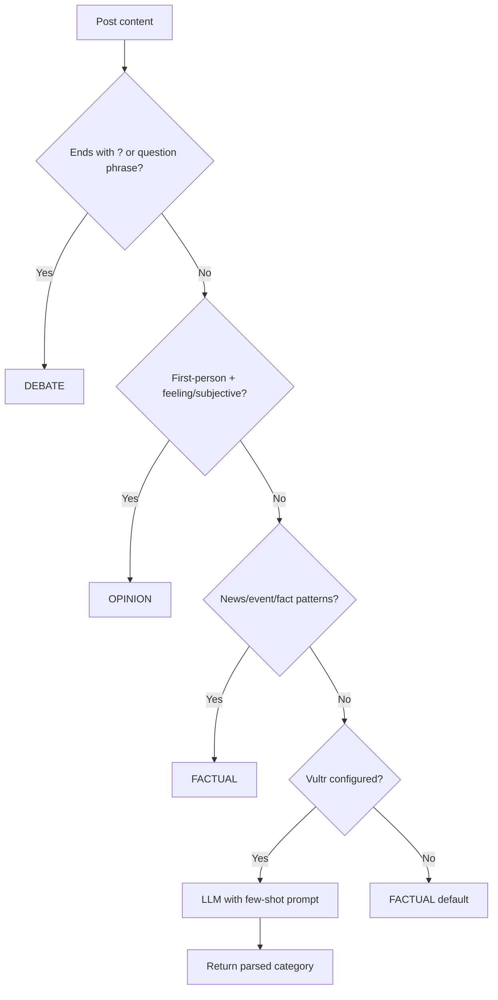

# Fix Post Classification for MVP

## How classification works today




**Entry points:** `[app/api/posts/route.ts](app/api/posts/route.ts)` line 112 and `[app/api/classify/route.ts](app/api/classify/route.ts)` both call `classifyPostContent()`.

**Current local fallback** (`[lib/services/vultrService.ts](lib/services/vultrService.ts)` lines 40–58):


| Rule        | Pattern                                                        | Example                              |
| ----------- | -------------------------------------------------------------- | ------------------------------------ |
| DEBATE      | ends with `?`, or contains `should`, `what do you think`, etc. | "do i look handsome today?" → DEBATE |
| OPINION     | contains `i think`, `i believe`, `love`, `hate`, `best`, etc.  | "I love this product" → OPINION      |
| **Default** | everything else                                                | **→ FACTUAL**                        |


**Vultr prompt** (lines 20–26) is a short 3-line definition with no examples. When `VULTR_API_KEY` / `VULTR_INFERENCE_API_KEY` is set (likely true in your hackathon env), the **LLM result wins** and the local fallback is only used on API failure or unparseable output.

---

## Why "I am happy today" becomes FACTUAL

1. **Vultr is probably active** — its answer overrides local rules.
2. **The LLM prompt is too broad** — "Claims a verifiable event…" is interpreted loosely; short personal statements often get labeled FACTUAL.
3. **Local fallback would also miss it** — "I am happy today" does not match any OPINION regex (`i think`, `love`, `best`, etc.), so fallback defaults to FACTUAL too.
4. **DEBATE works** because `?` at the end is an explicit, high-confidence rule that even the fallback catches.

---

## Your proposed taxonomy — yes, it is sound for MVP


| Category    | Signal                                      | Example                            |
| ----------- | ------------------------------------------- | ---------------------------------- |
| **OPINION** | First-person personal expression / feelings | "I am happy today", "I feel tired" |
| **DEBATE**  | Question seeking discussion                 | "do i look handsome today?"        |
| **FACTUAL** | Third-person or objective event/stat claim  | "There was an earthquake in Japan" |


This matches `[PROJECT_PLAN.md](PROJECT_PLAN.md)` intent: only FACTUAL posts get truth scoring; OPINION/DEBATE get Agree/Disagree.

**Caveat for demo:** "I heard there was an earthquake in Japan" mixes first-person framing with a factual claim. For hackathon MVP, a simple rule like *first-person + feeling word → OPINION; otherwise if it looks like a news/event statement → FACTUAL* is good enough.

---

## Recommended fix: heuristic-first, Vultr as backup

For a hackathon demo, **deterministic rules should run first** so classification is predictable on stage. Vultr stays integrated as the fallback for ambiguous text (sponsor requirement), not the primary decider for obvious cases.




### Proposed heuristic rules (in priority order)

**1. DEBATE** (keep + slightly expand existing)

- Ends with `?`
- Starts with: `do`, `does`, `is`, `are`, `should`, `would`, `what`, `who`, `why`, `how`, `can`

**2. OPINION** (new — your rule)

- Contains first-person: `\b(i|i'm|i am|my|me)\b`
- AND contains feeling/subjective word: `happy`, `sad`, `feel`, `feeling`, `love`, `hate`, `think`, `believe`, `best`, `worst`, `beautiful`, `handsome`, `ugly`, `amazing`, `terrible`, `favorite`, `like`, `dislike`, `proud`, `excited`, `angry`, `grateful`, etc.

**3. FACTUAL** (explicit signals before default)

- Third-person / news patterns: `\b(there is|there was|there are|happened|announced|reported|earthquake|died|resigned|percent|%|\d+)\b`
- Or: no first-person `I/my/me` + mentions place/event (simple keyword list: `Japan`, `government`, `company`, `CEO`, etc.) — optional for MVP

**4. Fallback**

- If Vultr key present → call improved LLM prompt (below)
- Else → FACTUAL


### Improved Vultr prompt (for ambiguous cases only)

Add **few-shot examples** to `[CLASSIFICATION_SYSTEM_PROMPT](lib/services/vultrService.ts)`:

```
Examples:
- "I am happy today." → OPINION
- "do i look handsome today?" → DEBATE
- "There was an earthquake in Japan." → FACTUAL
- "This is the best phone ever." → OPINION
- "Should students date in school?" → DEBATE
- "Mr. Ho resigned from ABC Corp." → FACTUAL

Rules:
- OPINION: personal feelings, preferences, subjective judgments (especially first-person)
- DEBATE: questions or open prompts with no single verifiable answer
- FACTUAL: claims about real-world events, stats, or third-party facts that could be verified

Output ONLY: FACTUAL / OPINION / DEBATE
```

Also bump `max_tokens` from 8 → 16 so the model has room if it echoes an example.

---

## Code changes (single file focus)

All logic lives in `[lib/services/vultrService.ts](lib/services/vultrService.ts)`:

1. **Refactor** `classifyWithFallback()` → `classifyWithHeuristics()` with the ordered rules above.
2. **Reorder** `classifyPostContent()`:

```ts
   const heuristic = classifyWithHeuristics(content);
   if (heuristic !== null) return heuristic; // confident match
   // else try Vultr, else FACTUAL
   

```

   Return `null` from heuristics when no rule matches (ambiguous), not default FACTUAL immediately.
3. **Update** `CLASSIFICATION_SYSTEM_PROMPT` with few-shot examples.
4. **Add** a small exported test helper or inline comment table documenting expected outputs for demo QA.

No schema, API route, or UI changes required — category is still set at insert time in `[app/api/posts/route.ts](app/api/posts/route.ts)`.

---

## Expected results after fix


| Post                                | Before                  | After   |
| ----------------------------------- | ----------------------- | ------- |
| "I am happy today."                 | FACTUAL                 | OPINION |
| "do i look handsome today?"         | DEBATE                  | DEBATE  |
| "There was an earthquake in Japan." | FACTUAL (maybe via LLM) | FACTUAL |
| "I think the iPhone is the best."   | FACTUAL or OPINION      | OPINION |
| "Mr. Ho resigned from ABC."         | FACTUAL                 | FACTUAL |


---

## Demo tip

During the hackathon pitch you can say: *"Obvious cases are classified instantly with simple rules; edge cases go to Vultr Serverless Inference"* — this is honest, reliable on stage, and still credits the sponsor.